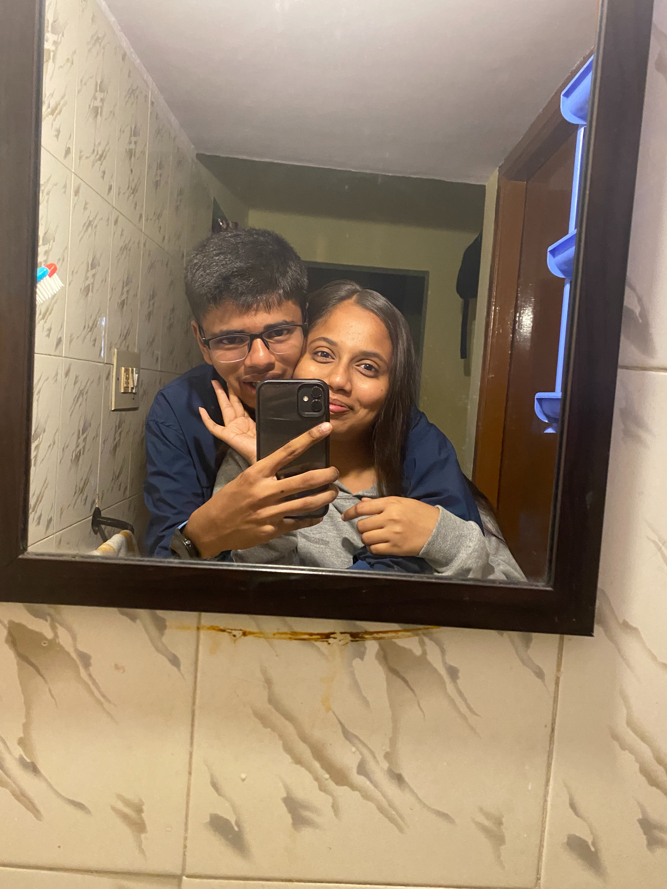
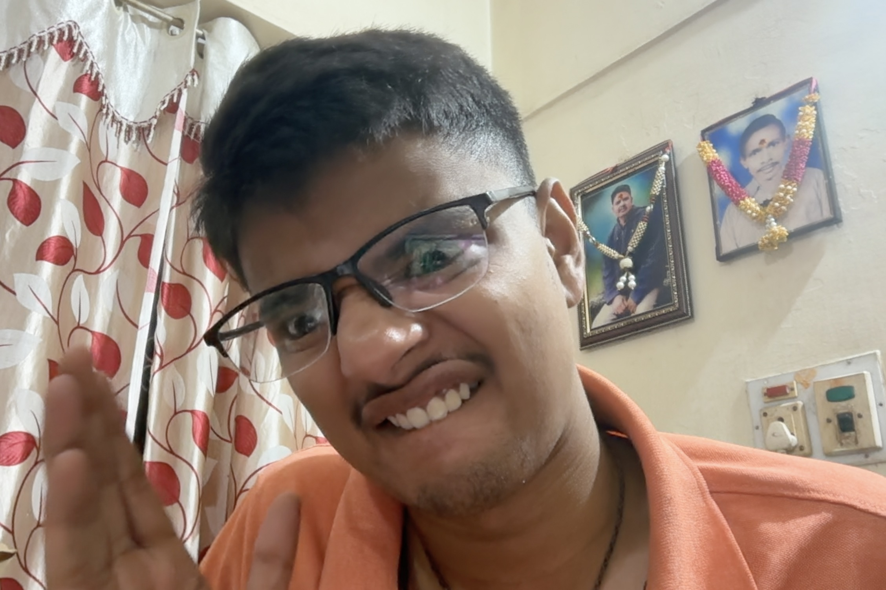
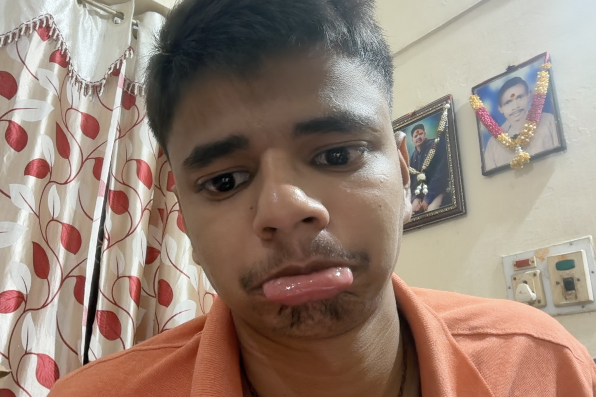

I want you to build a complete, polished, highly personalized interactive digital experience for my girlfriend.

IMPORTANT: I need the COMPLETE WORKING IMPLEMENTATION, not a design explanation, pseudocode, partial snippets, or suggestions.

This is a surprise gift I need to finish and deploy tonight. Prioritize a complete, polished, working experience over unnecessary technical complexity.

I DO NOT want a normal romantic website.

I have already made my girlfriend:
- an anniversary website
- Canva photo cards
- handwritten letters
- long romantic texts
- photo/memory gifts

Therefore this experience MUST feel fundamentally different.

==================================================
CORE CONCEPT
==================================================

Build an interactive experience that feels like:

A FAKE FUTURISTIC AI SYSTEM
→ turns into a funny interrogation/meme sequence
→ gets interrupted by a mysterious system takeover
→ recovers a conversation
→ transitions into a dreamy interactive story/game world
→ explores our relationship memories
→ handles a recent fight and reconciliation
→ ends with a final long personal message.

The experience should feel like a SMALL DIGITAL MOVIE / GAME, not a website.

The emotional journey should be:

CONFUSION
→ LAUGHTER
→ CURIOSITY
→ NOSTALGIA
→ EMOTION
→ LOVE

Do NOT make it immediately obvious that this is a romantic gift.

==================================================
TECHNICAL REQUIREMENTS
==================================================

Build the entire project as a SINGLE FILE:

index.html

Use only:
- HTML
- CSS
- Vanilla JavaScript

Do NOT use:
- React
- Next.js
- Node.js
- backend
- database
- APIs
- authentication
- build tools
- external AI services
- frameworks

The final project folder will look EXACTLY like this:

/project-folder
│
├── index.html
├── us.jpg
├── me1.jpg
├── me2.jpg
└── me3.jpg

These image files WILL DEFINITELY EXIST.

IMPORTANT:
Do not treat these images as optional.

The code must load them directly from the same folder using relative paths.

Example:

I should be able to:

1. Create a folder.
2. Put index.html inside it.
3. Put us.jpg, me1.jpg, me2.jpg and me3.jpg inside it.
4. Open index.html.
5. Experience the entire thing.

It should also be easy to deploy to GitHub Pages, Netlify, or Vercel.

==================================================
IMPORTANT DESIGN PHILOSOPHY
==================================================

DO NOT make this look like:

- a Valentine's Day website
- a wedding website
- a generic couples website
- a Canva template
- a scrapbook
- a photo gallery
- a timeline
- a Pinterest romance page
- "100 reasons why I love you"
- generic AI-generated romance

The first half should feel like a mysterious experimental digital system.

The middle should feel like discovering a memory/game.

The final part should become extremely simple and intimate.

The website should visually evolve throughout the experience.

It should feel like:

"A technically inclined boyfriend spent an entire night building something ridiculous, funny, personal and unexpectedly emotional for his girlfriend."

NOT:

"A professional company designed a romantic landing page."

==================================================
PEOPLE
==================================================

My name:

Shreyas

Her name:

Sneha

The name I call her most frequently:

Cutu

Other names I use:

- Cutu
- Cutu baby
- Baby
- Babe
- Chotu Don
- Cute little patootoo

==================================================
RELATIONSHIP START TIME
==================================================

We officially became boyfriend and girlfriend at:

3 May 2024
11:23:25 PM
India Standard Time

IMPORTANT:

Create a LIVE relationship duration counter.

Calculate dynamically from:

2024-05-03 23:23:25
Asia/Kolkata

to the exact moment she opens the website.

Display:

- Years
- Months
- Days
- Hours
- Minutes
- Seconds

Update every second.

Do NOT hardcode the duration.

IMPORTANT:

Calculate calendar years/months/days correctly.

Do not simply divide milliseconds into months because months have different lengths.

This relationship counter should appear later in the experience in an elegant way.

==================================================
TEXTING STYLE
==================================================

The writing must feel like OUR actual texting.

We naturally mix Hindi and English.

We use phrases like:

- hehe
- hehehe
- achaaa
- achaa achha
- badhiya
- cutu
- baby
- dear
- darlingggg
- goodd
- pakkaaa
- hmm
- han
- nah
- arre
- okay donee
- kya hi
- achaq
- etc.

Do NOT make the grammar overly polished.

Do NOT turn our conversations into movie dialogue.

The charm is in slightly messy natural Hindi-English texting.

I frequently call her "cutu".

==================================================
PHASE 1 — US.AI
==================================================

The experience begins automatically.

The screen is dark.

Minimal futuristic interface.

NO hearts.

NO romantic message.

NO "I love you" immediately.

Display:

US.AI

Subtitle:

PRIVATE RELATIONSHIP INTELLIGENCE SYSTEM

Small technical information:

MODEL: US-01
STATUS: INITIALIZING
ACCESS: RESTRICTED
DATASET: CLASSIFIED

Use us.jpg somewhere in this opening.

IMPORTANT:

us.jpg should be integrated into the US.AI identity screen as a meaningful visual element.

It can be shown as a classified/profile/system image.

For example:

[ IMAGE: us.jpg ]

SUBJECTS DETECTED:
SHREYAS
SNEHA

RELATIONSHIP STATUS:
ANALYZING...

Do not make it look like a normal photo gallery.

Make it feel like part of the fake AI system.

Then show boot messages automatically:

Initializing...

Loading personality data...

Loading behavioral patterns...

Loading questionable decisions...

Loading emotional damage...

Loading food-related arguments...

Loading Cutu dependency...

ERROR:
Dependency exceeds safe limits.

Pause.

Then:

System ready.

A large button appears:

[ ENTER ]

==================================================
PHASE 2 — THE SHREYAS.EXE MALFUNCTION
==================================================

After ENTER is clicked, begin the funny image sequence.

There are EXACTLY THREE REQUIRED IMAGES:

me1.jpg
me2.jpg
me3.jpg

They should appear ONE AT A TIME.

They should NOT appear together.

They should NOT appear as a gallery.

They are part of the storytelling.

--------------------------------------------------
IMAGE 1 — me1.jpg
--------------------------------------------------

This image should appear dramatically.

Use subtle zoom/entrance animation.

Caption sequence:

"Hmmmmmm..."

Pause.

"So..."

Pause.

"You think I'm going to forgive you that easily???"

Let the image stay for a moment.

Then transition.

--------------------------------------------------
IMAGE 2 — me2.jpg
--------------------------------------------------

Replace the first image with me2.jpg.

This should feel increasingly ridiculous.

Text:

"WAIT."

Pause.

"Who the fuck allowed this guy into the system?"

Pause.

"System security is clearly terrible."

Transition.

--------------------------------------------------
IMAGE 3 — me3.jpg
--------------------------------------------------

Show me3.jpg.

Caption:

"Oh."

Pause.

"Never mind."

Pause.

"That's just Shreyas.exe."

Pause.

"He's behaving normally."

Then the image should disappear dramatically.

Text remains:

"Please ignore him."

Pause.

"He's not in charge here."

Pause.

"Actually..."

Pause.

"I already forgave you."

Pause.

"Or maybe I didn't."

Pause.

"Wait."

Pause.

"What the fuck..."

Pause.

"Who did I forgive?"

Pause.

"Fuck all this confusion."

Pause.

"Hehehe."

Then:

"I love you cutu."

Pause.

"Tu cute hai toh zyada der gussa bhi kaise rahun?"

IMPORTANT:

This should feel playful and chaotic.

Do not make it poetic.

Do not make it overly romantic.

It should genuinely feel like Shreyas is messing around.

==================================================
PHASE 3 — SYSTEM INTERRUPTION
==================================================

Immediately after the playful sequence, everything freezes.

The screen glitches.

The previous UI disappears.

The screen becomes almost completely black.

Terminal-style interface.

Monospace font.

Fast technical text.

Display automatically:

> SYSTEM INTERRUPTION

> UNAUTHORIZED MEMORY ACCESS DETECTED

> SEARCHING PRIVATE ARCHIVES...

> MEMORY MODULE FOUND

> MEMORY INDEX: 001

> MEMORY INDEX: 002

> MEMORY INDEX: 003

> RECOVERING...

> RESTORING CONVERSATION...

Then:

CONVERSATION RECOVERED.

Pause.

Everything fades.

==================================================
PHASE 4 — RECOVERED CHAT
==================================================

Now show a realistic private chat interface.

This should visually contrast with the terminal.

Make it feel like a real messaging conversation.

Messages automatically appear one by one.

Use realistic delays.

Do NOT show the full WhatsApp conversation.

Instead show a SHORT fictionalized conversation inspired by our actual texting style.

Conversation:

Shreyas:
Hi

Sneha:
Hi

Shreyas:
Good morning cutu

Sneha:
Good morninggg

Shreyas:
Kaise ho ?

Sneha:
Finee tum batao

Shreyas:
Badhiya

Shreyas:
Kahan pe ho ?

Sneha:
Bus mein hoon

Sneha:
College jaa rahi hun

Shreyas:
Achaaa

Sneha:
Hehehe

Shreyas:
Theek se jaana cutu

Sneha:
Hannn baba

Make the messages type themselves.

Use natural pauses.

The conversation should feel normal.

Then after the final message:

The chat freezes.

A tiny glitch occurs.

Display:

MEMORY RECONSTRUCTION COMPLETE

Pause.

Then:

WARNING

Pause.

"This conversation is not being analyzed."

Pause.

"It is being remembered."

Then the screen slowly fades completely white.

==================================================
PHASE 5 — DREAM TRANSITION
==================================================

From the white screen slowly reveal a soft dreamy 2D world.

The visual inspiration should be:

- location-based exploration games
- Pokémon-Go-like map feeling
- cozy mobile RPG maps
- animated storybooks

IMPORTANT COPYRIGHT RULE:

Do NOT copy Pokémon characters.

Do NOT use Pokémon assets.

Do NOT use Pokémon logos.

Do NOT use copyrighted Pokémon artwork.

Create an ORIGINAL visual style inspired only by:

"two small characters exploring memories on a map."

The world should contain:

- paths
- grass
- trees
- benches
- small houses/buildings
- glowing markers
- stars
- clouds
- subtle moving elements

The characters should be simple original stylized avatars.

Characters:

SHREYAS
CUTU

The visual should be cute and dreamy.

Not childish.

Not pixel-perfect retro unless it fits.

Mobile friendly.

==================================================
STORY MAP
==================================================

Display:

WELCOME TO THE STORY OF US

Then:

A small exploration map appears.

The map contains sequential locations.

Do NOT create complicated gameplay.

The story is the main focus.

Locations unlock sequentially.

The user taps/clicks the next glowing location.

Locations:

1. THE SECRET HUG
2. PARENTS DETECTED
3. HALLWAY CHAOS
4. SILENT CONVERSATIONS
5. THE FOOD QUEST
6. PAGAL INSAAN PROTOCOL
7. CUTU SLEEP MODE
8. THE GREAT ARGUMENT
9. FINDING OUR WAY BACK

Make transitions between locations feel like traveling through memories.

==================================================
LOCATION 1 — THE SECRET HUG
==================================================

This represents a real memory.

One time I was at Sneha's home alone with her.

I went behind her.

I hugged her from behind.

We were taking a photo.

Then suddenly things went completely wrong.

Represent the beginning warmly and innocently.

The two characters stand together.

Shreyas approaches Sneha.

A small interaction occurs.

Display something subtle like:

MEMORY FOUND

"Just a normal peaceful moment."

Pause.

Then:

"Obviously, it did not remain peaceful."

Move to the next memory.

==================================================
LOCATION 2 — PARENTS DETECTED
==================================================

Continue the same memory.

While we were together taking the photo, her parents arrived.

Her father knocked/kicked the door extremely loudly.

I immediately panicked.

I rushed to the bathroom.

I was sweating like crazy.

Sneha was also dealing with the situation and everything became chaotic.

Turn this into a funny mini-game/story.

Suddenly:

BANG!

Visual shake.

Display:

PARENTS DETECTED

Then:

ALERT LEVEL:
██████████ 100%

Shreyas character should run toward a bathroom icon.

Display funny stats:

PANIC LEVEL: MAXIMUM

SWEAT PRODUCTION: UNPRECEDENTED

STEALTH SKILL: QUESTIONABLE

ESCAPE PLAN: BATHROOM

Sneha character can have:

STATUS:
"WHAT IS EVEN HAPPENING?"

Keep it funny and wholesome.

==================================================
LOCATION 3 — HALLWAY CHAOS
==================================================

Represent our secret little moments:

- small hugs
- tiny peekaboo kisses
- quickly checking whether someone is coming
- suddenly realizing people are entering the hall
- immediately separating/running around like idiots

Make this feel like a stealth game.

Start:

MISSION:
5 SECOND MOMENT

STATUS:
CLEAR

The two characters move closer.

Then:

PEOPLE DETECTED: 1

Characters pause.

Then:

PEOPLE DETECTED: 2

Then:

PEOPLE DETECTED: 4

Then both characters quickly run in ridiculous directions.

Display:

STEALTH RATING:
2/10

COORDINATION:
0/10

FUN:
100/10

Keep it wholesome.

No explicit sexual content.

==================================================
LOCATION 4 — SILENT CONVERSATIONS
==================================================

We sometimes have silent video calls / conversations.

We communicate through gestures and signs without actually talking.

Make this section visually calm.

Characters sit opposite each other.

For a few seconds there is almost no dialogue.

Small gesture bubbles appear.

Tiny hand/sign animations.

Then:

VOICE:
OFF

UNDERSTANDING:
100%

Display:

"Sometimes we didn't even need words."

Keep this section quiet and simple.

==================================================
LOCATION 5 — THE FOOD QUEST
==================================================

This is one of our biggest recurring jokes.

Whenever we go somewhere to eat:

I want her to order.

She wants me to order.

The conversation becomes:

Shreyas:
Tu kuch order karde

Sneha:
Tu order karega

Shreyas:
Tu kuch order karde mereko tere pasand ka khaana hai

Sneha:
Tu order kar

Shreyas:
Arre mai leke aaya hoon na

Mai treat de raha hoon

Tu order karegi

Sneha:
Tu treat de raha hai na

Toh tu order karega

Turn this into a funny battle.

Title:

ORDER BATTLE

Show two buttons/actions:

SHREYAS USED:
YOU ORDER

SNEHA COUNTERED WITH:
NO, YOU ORDER

Repeat the exchange dramatically.

Eventually:

SYSTEM ERROR

BOTH PLAYERS REFUSE TO ORDER.

Pause.

SOLUTION FOUND.

CUTU ORDERS.

Then:

SHREYAS WINS:
ABSOLUTELY NOTHING.

Then display:

BONUS RELATIONSHIP DISCOVERY:

EVERY FIGHT SOMEHOW ENDS WITH FOOD.

==================================================
LOCATION 6 — PAGAL INSAAN PROTOCOL
==================================================

Sneha often says:

"Pagal insaan"

"Kuch toh sharam karle"

My response is:

"Agar tere paas bhi sharam karni pad jaaye toh tu as a GF fail ho jayegi."

"Dekh tere liye hi besharam hoon."

"Toh khudko kyun fail karna chahti hai?"

Show this as a playful dialogue interaction.

Preserve the Hindi-English.

Do NOT translate it into polished English.

Then the fake AI system interrupts:

SYSTEM OBSERVATION:

Shreyas uses the word:

"Cutu"

approximately every 4.7 seconds.

Then:

RECALCULATING...

2.3 seconds.

Then:

RECALCULATING...

CONSTANTLY.

==================================================
LOCATION 7 — CUTU SLEEP MODE
==================================================

This is a funny observation Sneha may not even know I think about.

Sometimes she falls asleep while we are talking/chatting.

I imagine her like:

- one eye closing
- the other eye still somehow looking at the phone
- holding the phone
- looking completely sleepy/high
- pretending she is still awake

I sometimes imagine:

"If I told her to get up and bring water while she's half asleep, would she actually walk there like that?"

Make this into a cute funny animation.

The Cutu character slowly becomes sleepy.

One eye closes.

Phone stays in hand.

Display:

CUTU.exe HAS ENTERED SLEEP MODE

Phone:
STILL ACTIVE

Brain:
QUESTIONABLE

Boyfriend:
OBSERVING RESPECTFULLY

Then:

EXPERIMENT PROPOSED:

"Tell her to get water."

Two buttons:

YES

ABSOLUTELY NOT

Regardless of selection, make the response funny.

For example:

SYSTEM DECISION:

Do not disturb sleeping Cutu.

Risk assessment:
EXTREMELY HIGH.

==================================================
LOCATION 8 — THE GREAT ARGUMENT
==================================================

This is emotionally important.

Handle it maturely.

Do NOT guilt-trip Sneha.

Do NOT portray her as the villain.

Do NOT portray me as automatically correct.

The situation:

I was angry because I felt that she wasn't taking seriously certain things I repeatedly told her out of care and concern.

I felt ignored and frustrated.

For around three days, our conversations became dry and distant.

Then Sneha sent me a heartfelt apology.

She explained that she understood my concern came from care.

She admitted that sometimes she heard me but did not properly listen.

She said she wanted to improve through actions rather than promises.

She didn't want our relationship to become a place where we constantly fight.

She wanted us to feel loved, understood, respected and happy.

She appreciated my support.

She wanted to prove through actions that she could do better.

Then we talked.

I told her:

"I have already forgiven you dear."

I also apologized for anything I might have said while angry.

We checked whether the other person was okay.

We talked calmly.

Eventually we found our way back.

IMPORTANT:

Represent this as:

TWO PEOPLE
→ hurt
→ distance themselves
→ miss each other
→ communicate
→ understand
→ apologize
→ choose each other again

NOT:

BOY WAS RIGHT
→ GIRL APOLOGIZES
→ HAPPY ENDING

==================================================
THE GREAT ARGUMENT — GAME BATTLE
==================================================

Represent the conflict as a playful game battle.

Display:

THE GREAT ARGUMENT

Then stats:

ANGER
█████████░ 90%

EGO
███████░░░ 70%

MISUNDERSTANDING
████████░░ 80%

MISSING EACH OTHER
██████████ 100%

ABILITY TO STAY MAD FOREVER
░░░░░░░░░░ 0%

Pause.

Then:

BATTLE RESULT:

NO WINNER.

Pause.

"Because this was never supposed to be a battle."

Pause.

Then:

BOTH PLAYERS CHOSE:

US.

This should be emotionally powerful but not melodramatic.

==================================================
LOCATION 9 — FINDING OUR WAY BACK
==================================================

The two characters are initially standing apart.

The environment is quiet.

Then small paths begin glowing between them.

The characters slowly walk toward each other.

The world becomes warmer.

Show short lines one at a time:

"She listened."

"He listened."

"She apologized."

"He apologized too."

"They explained how they felt."

"They stopped trying to win."

Pause.

"They remembered they were on the same team."

Then:

"They found their way back."

The characters stand together.

Do not use an excessive amount of hearts.

Make the emotion come from simplicity.

==================================================
QUEST COMPLETE
==================================================

After the final story location:

Display:

QUEST COMPLETE

Then:

MISSION:
FIND OUR WAY BACK

STATUS:
COMPLETED

Stats:

ANGER:
0%

EGO:
0%

LOVE:
still ridiculous

FOOD AFTER FIGHT:
GUARANTEED

RELATIONSHIP STATUS:
ACTIVE

Then show the LIVE RELATIONSHIP COUNTER.

Title:

TIME SINCE WE BECAME US

Calculate from:

3 May 2024
11:23:25 PM
IST

Display:

XX YEARS
XX MONTHS
XX DAYS
XX HOURS
XX MINUTES
XX SECONDS

Update every second.

Make this a beautiful quiet moment.

==================================================
FINAL SYSTEM REVEAL
==================================================

After the relationship counter, transition back very subtly to the US.AI interface.

Display:

US.AI // FINAL ANALYSIS

Then:

Analysis complete.

Pause.

One anomaly remains.

Pause.

The creator of this system appears to be emotionally compromised.

Pause.

CREATOR IDENTIFIED:

SHREYAS

Pause.

Original purpose of system:

NOT TO ANALYZE HER.

Pause.

TO MAKE SOMETHING FOR HER.

Pause.

Then:

ONE FINAL FILE RECOVERED.

Show a fake file card:

SHREYAS_FINAL_MESSAGE.txt

Metadata:

SIZE:
Unnecessarily large

ESTIMATED READING TIME:
Bro seriously?

Then:

Yes.

He did it again.

It's a long message.

This is a joke because long emotional messages are my signature.

Button:

[ OPEN FINAL MESSAGE ]

==================================================
FINAL MESSAGE SCREEN
==================================================

When she clicks:

OPEN FINAL MESSAGE

Everything should change.

Remove:

- terminal
- futuristic UI
- map
- game
- stats
- technical elements

Transition to a calm, intimate reading environment.

Use:

- soft background
- elegant readable typography
- comfortable mobile spacing
- subtle texture/gradient
- minimal visual distractions

At the top:

For my Cutu ❤️

Then display my final message.

IMPORTANT:

I WILL WRITE THE FINAL MESSAGE MYSELF.

Create a clearly marked JavaScript variable near the top of the file:

const FINAL_MESSAGE = `
PASTE YOUR FINAL LONG MESSAGE HERE
`;

The code should correctly preserve paragraphs and line breaks.

Do NOT generate a generic love letter.

Do NOT fill this with placeholder romantic content.

Just make it extremely easy for me to paste my own message.

At the bottom of the message display:

CASE CLOSED.

Then:

Until our next stupid fight.

Pause.

Which will probably end with food.

Then optionally:

❤️

Keep the ending simple.

==================================================
IMAGE CONFIGURATION
==================================================

Near the top of the JavaScript create:

const CONFIG = {
    myName: "Shreyas",
    herName: "Sneha",
    nickname: "Cutu",

    relationshipStart: {
        year: 2024,
        month: 5,
        day: 3,
        hour: 23,
        minute: 23,
        second: 25,
        timezone: "Asia/Kolkata"
    },

    usImage: "us.jpg",

    openingImages: [
        "me1.jpg",
        "me2.jpg",
        "me3.jpg"
    ]
};

IMPORTANT:

These exact files exist in the same directory.

Do not replace them.

Do not use external image URLs.

Do not use stock images.

==================================================
ANIMATION REQUIREMENTS
==================================================

Use lightweight CSS and JavaScript animations.

Include:

- fade-ins
- fade-outs
- typewriter effects
- blinking cursor
- terminal text scrolling
- subtle glitches
- image entrance
- image exit
- image zoom
- dialogue bubble animations
- character movement
- location unlocking
- map movement
- soft particles if lightweight
- smooth transitions between phases

IMPORTANT:

Do not overanimate.

Do not make every element bounce.

Do not make it feel like a PowerPoint.

Animations should support storytelling.

==================================================
MOBILE-FIRST
==================================================

This will most likely be opened on a phone.

Design MOBILE FIRST.

Requirements:

- no horizontal scrolling
- large readable text
- touch-friendly buttons
- comfortable margins
- chat fits small screens
- map fits phone screens
- images scale properly
- no tiny UI
- no hover-only interactions
- smooth performance

Desktop should also look good.

==================================================
USER INTERACTION
==================================================

Most of the story should progress automatically.

Do NOT force her to click "Next" after every sentence.

Use clicks only at meaningful moments:

- ENTER
- start exploring map
- open next memory
- optional funny choices
- OPEN FINAL MESSAGE

The experience should feel cinematic.

==================================================
NO AUDIO
==================================================

DO NOT add:

- background music
- autoplay music
- song embeds
- sound-dependent storytelling

The entire experience must work silently.

Sneha may open it somewhere she cannot listen to music.

==================================================
WRITING STYLE
==================================================

The writing should sound like Shreyas.

Playful.

Chaotic.

Slightly stupid in a funny way.

Affectionate.

Uses Hindi-English.

Uses:

- hehe
- hehehe
- cutu
- baby
- dear
- arre
- achaaa

Do not make me sound poetic.

Do not make me sound like a romance novelist.

Do not make every moment emotional.

Humor is extremely important.

The emotional moments should work BECAUSE the rest of the experience is funny and personal.

==================================================
ANTI-CRINGE RULES
==================================================

Absolutely avoid generic phrases such as:

"You are my universe."

"You complete me."

"You're my everything."

"Forever and always."

"Two souls destined to meet."

"You are the missing piece."

"My soulmate."

Generic Pinterest quotes.

Generic Valentine's Day language.

Too many hearts.

Excessive pink.

Overly poetic paragraphs.

Fake philosophical quotes.

The emotional impact must come from REAL MEMORIES.

==================================================
VISUAL EVOLUTION
==================================================

The visual language MUST evolve clearly.

PHASE 1:
Dark futuristic US.AI system.

PHASE 2:
Funny Shreyas.exe meme/photo malfunction.

PHASE 3:
Black terminal system interruption.

PHASE 4:
Recovered realistic chat.

PHASE 5:
White dream transition.

PHASE 6:
Original exploration game/map.

PHASE 7:
Funny relationship memories.

PHASE 8:
The argument and reconciliation.

PHASE 9:
Live relationship counter.

PHASE 10:
Final US.AI analysis.

PHASE 11:
Minimal intimate final message.

This evolution is EXTREMELY IMPORTANT.

==================================================
CODE QUALITY
==================================================

Even though everything is inside index.html, organize the JavaScript cleanly.

Suggested sections:

1. CONFIGURATION
2. APP STATE
3. RELATIONSHIP COUNTER
4. OPENING EXPERIENCE
5. PHOTO SEQUENCE
6. TERMINAL SYSTEM
7. CHAT RECOVERY
8. STORY MAP
9. STORY LOCATIONS
10. FINAL REVEAL
11. FINAL MESSAGE

Suggested functions:

startExperience()

showUSAI()

showPhotoSequence()

showSystemInterruption()

startRecoveredChat()

transitionToDreamWorld()

showStoryMap()

openLocation(locationId)

completeLocation(locationId)

showRelationshipCounter()

startFinalReveal()

showFinalMessage()

You can use different names if needed.

Keep the code understandable.

Avoid unnecessary complexity.

Avoid console errors.

Avoid broken transitions.

==================================================
IMPORTANT FINAL REQUIREMENT
==================================================

OUTPUT THE COMPLETE WORKING index.html.

Do NOT give:

- pseudocode
- partial implementation
- snippets
- "continue this yourself"
- "you can add this later"
- implementation explanations instead of code

I want the FULL CODE.

The final experience should work from start to finish.

The most important sequence is:

US.AI
→ us.jpg introduction
→ ENTER
→ me1.jpg funny interrogation
→ me2.jpg system getting worse
→ me3.jpg Shreyas.exe malfunction
→ "I love you cutu"
→ SYSTEM INTERRUPTION
→ terminal recovery
→ chat sequence
→ "It is being remembered"
→ dreamy transition
→ interactive memory map
→ secret hug
→ parents detected / bathroom panic
→ hallway chaos
→ silent conversations
→ food ordering battle
→ pagal insaan / cutu protocol
→ cutu sleep mode
→ great argument
→ reconciliation
→ finding our way back
→ live relationship duration
→ US.AI final analysis
→ SHREYAS_FINAL_MESSAGE.txt
→ my long personal message

Prioritize STORYTELLING and TRANSITIONS over complicated game mechanics.

The game/map should support the memories, not become a real game that takes too long to build.

Make it polished.

Make it personal.

Make it funny.

Make it surprisingly emotional.

Make it feel handmade by someone who actually knows the person receiving it.

Now provide:

1. A very brief setup instruction.
2. The COMPLETE index.html code.
3. A very brief note showing exactly where I paste my final message.

DO NOT OMIT ANY CODE.